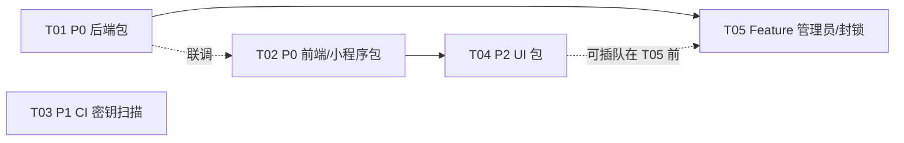

# 架构设计 · 整明白 v3.2

> 架构师：高见远 | 日期：2026-07-25 | 基线：v3.1.0 生产（commit 1c057c0）
> 输入：`docs/开发任务书-v3.2-团队执行版.md`（修复方案已写死，本文档只做核实 + 任务分解 + 少量新增技术决策）
> 纪律：任务书修复方案逐条执行不自由发挥；`qwen-*` fallback 一行不删；最小变更。

---

## 一、核实结论（逐条对应任务书要求核实项）

### 1.1 微信回调两 bug —— ✅ 代码确已修复，仅欠部署 + 真机验证

| Bug | 核实文件 | 现状 |
|-----|---------|------|
| 路由 404（只挂根路径） | `server/src/modules/wechat/routes.ts:48-51` | ✅ 已挂双路径：`GET/POST /` 与 `GET/POST /message` 四条路由并存 |
| 兼容模式吞消息 | `server/src/modules/wechat/service.ts:53-62` | ✅ 已修复：`hasPlaintext` 判定——仅「仅 `<Encrypt>` 无明文」（纯安全模式）才放行跳过；兼容模式（明文+Encrypt 并存）记日志后按明文正常处理 |

**结论：1.1 不排开发任务**，转为部署验证任务（owner + 运维）：微信后台重提 URL `https://zhengmingbai.cn/api/v1/wechat/message`、Token `zmb_wechat_msg_2026`、兼容模式，真机发消息确认收到。

### 2.1 AI 模型名现状 —— ❌ 确认未修，正是 404 根因

| 位置 | 实际值（已逐行核实） | 说明 |
|------|--------------------|------|
| `server/src/modules/ai/vision-client.ts:22` | `getConfig('ai.vision_model', 'qwen-vl-plus')` | 默认还是百炼名 |
| `server/src/modules/ai/llm-client.ts:40` | `getConfig('ai.text_model', 'qwen-plus')` | 默认还是百炼名 |
| `server/src/modules/configs/service.ts:31-32` | seed 默认 `qwen-vl-plus` / `qwen-plus` | 新库 seed 就是错的 |
| `server/src/seed-cli.ts:111-112` | `doubao-vision-pro-32k` / `doubao-pro-32k` | 占位假名（火山无此 ID），也是 404 来源 |
| provider 机制 | `openai-compat.ts:43-47` `resolveProvider()` 读 `ai.provider`（默认 `volcengine`） | 机制本身没问题，坏在模型名 |

**修复口径**（与任务书 §2.1 一致，补充落点）：把「volcengine 生效时的默认模型名」改为 Doubao 系。由于现架构是「configs 表优先、代码默认兜底」单链，按最小变更原则：
- `llm-client.ts:40` 兜底默认 `'qwen-plus'` → `'Doubao-Seed-2.1-turbo'`
- `vision-client.ts:22` 兜底默认 `'qwen-vl-plus'` → `'doubao-seed-1-6-vision'`（占位，见 §六待明确）
- `configs/service.ts` seed 两 key 默认值同步改（存量库不动——configs 热改是运行态操作，见下方 SQL）
- `seed-cli.ts:111-112` 两处占位名同步改
- dashscope fallback 链（`openai-compat.ts` 的 `resolveEndpoint` / `FALLBACK_BASE_URL` / `ai.base_url`）一行不动；切回 dashscope 时通过 configs 表把 `ai.text_model/ai.vision_model` 改回 `qwen-*` 即可，**qwen-* 字面量在 fallback 配置路径中完整保留**

生产 configs 表订正 SQL（部署时执行）：
```sql
UPDATE configs SET value_json = '"Doubao-Seed-2.1-turbo"' WHERE key = 'ai.text_model';
UPDATE configs SET value_json = '"doubao-seed-1-6-vision"' WHERE key = 'ai.vision_model'; -- 待 owner 确认视觉实际 ID 后替换
```

### 3.1 账号页头部 CSS 现状 + 全局排查 —— 根因已定位

**核实结果**：`Account.tsx` 头部用的是共享组件 `web/src/components/PageHeader.tsx:23`，其 class 为：

```
sticky top-0 z-20 ... md:bg-transparent md:backdrop-blur-none
```

即：**只有手机档（<768px）sticky 有实际效果；平板/桌面档（≥768px）把 sticky 的背景与毛玻璃撤掉了**，且 `top-0` 是相对于 `AppShell` 主内容容器（`AppShell.tsx:120` 的内层 div）。滚动时头部随内容滚走——正是截图现象。

**全局同类结构排查**（使用 PageHeader 的页面，全部同病）：`Capture.tsx`（开始整理）、`Confirm.tsx`、`Messages.tsx`、`Points.tsx`、`Plan.tsx`、`Privacy.tsx`、`Account.tsx`、`SpaceDetail.tsx`、`Spaces.tsx`、`Store.tsx`、`TodoList.tsx`。

**修复口径（决策，最小变更、不动 12 个页面）**：只改共享组件 `PageHeader.tsx` 一处——把 sticky 扩展到全断点：
```
sticky top-0 z-20 bg-cream/95 backdrop-blur ... md:bg-cream/95 md:backdrop-blur md:px-0 md:py-3
```
即删掉 `md:bg-transparent md:backdrop-blur-none`，桌面档保留左对齐加大标题但加回粘性背景。一处改动全站受益，符合"全局排查同类"要求。

### 2.3 points.wxml —— ❌ 确认未修

`miniprogram/pages/points/points.wxml:36` 现状：
```xml
<view wx:else class="card tx-card" wx:for="{{transactions}}" wx:key="id">
```
`wx:else` 与 `wx:for` 同标签，编译不过。按任务书方案 `<block wx:else>` 包一层。

### 2.2 登录死循环 —— ❌ 确认未修，根因与任务书一致

- `auth/routes.ts:153-160` `loginSchema` 中 `...captchaFields` 为必填；
- `auth/routes.ts:166` `assertCaptcha()` 无条件调用；
- `Login.tsx:124-128` email_code 登录提交复用了发码时已消耗的 `codeCaptcha` → 必 2101 → 死循环。与任务书诊断完全一致。

### 4.3 SpaceDetail「undefined 次」—— 补充根因（任务书让查）

- 前端 `SpaceDetail.tsx:24` 声明 `session_count: number`，`:96` 渲染 `${detail.session_count} 次`；
- 后端 `spaces/service.ts:99-117` `getSpaceDetail()` 返回 `{ ...space, photos, after_photos, status }`——**`SpaceRow` 里没有 `session_count`**；`session_count` 只存在于 `listSpaces()` 的子查询（`:54`）。
- **根因确认：详情接口漏返回 `session_count` / `last_session_at`**。修复：`getSpaceDetail()` 补一个 `(SELECT COUNT(*) FROM sessions WHERE space_id = ?)` 子查询返回即可（单行补字段，不动结构）。

---

## 二、技术决策（仅新增决策）

### D1：users.status 字段迁移方案（§5.2）

- **列定义**：`status VARCHAR NOT NULL DEFAULT 'active'`，取值仅 `'active' | 'blocked'`（CHECK 约束 SQLite 加了也难维护，由 zod 层收口）。
- **迁移方式**：新建 `server/src/migrations/v32-users-status.ts`，仿 v22 风格用 `PRAGMA table_info(users)` 判存、幂等 ALTER TABLE；在 `db.ts:336` `migrateV31T2iRefPhoto()` 之后追加调用 `migrateV32UsersStatus()`。
- **默认值与回填**：`ADD COLUMN ... DEFAULT 'active'` 本身即完成存量回填（SQLite ALTER ADD COLUMN 带默认值时全表自动生效），**不需要单独 UPDATE 回填**。
- **出参影响**：`publicUser()` 增 `status` 字段；admin `listUsers/userDetail` SELECT 增 `u.status`。

### D2：封锁后已签发 JWT 的处理口径 —— **下次请求拦截（不立即失效）**

JWT 无状态、30 天有效，做服务端吊销要引 token 版本号/黑名单表，违背最小变更。决策：

1. **登录路径拦截**：`auth/service.ts login()` 内查到 `status='blocked'` → 抛 `new BizError(2004, '账号已被封禁，如有疑问请联系客服', 403)`（新错误码 2004，见 §五）。
2. **请求路径拦截**：`middleware/auth.ts` `authMiddleware` 验签通过后，增一次轻量查询 `SELECT status FROM users WHERE id = ?`——blocked 则返回 `403 + {code:2004}`。
   - **性能说明**：JWT 校验本来就是每请求一次，加一条主键点查（<0.1ms，WAL 读不阻塞）可接受，不引缓存（最小变更）。
   - 只拦 `user` scope；`admin` scope 票据（5 分钟三段式）同查同拦，防止封 admin 后还能操作。
3. **效果**：封锁即时生效于下一次请求（等价于准实时），前端 `api.ts` 对 403/2004 统一 toast「账号已被封禁」并登出清 token。

### D3：gitleaks CI 配置要点（§3.2）

- **CI job**：`.github/workflows/ci.yml` 增 `secret-scan` job，用官方 action `gitleaks/gitleaks-action@v2`，`GITLEAKS_LICENSE` 不需要（公开仓库/自研项目走免费档）。
- **`.gitleaks.toml` 要点**：
  ```toml
  [allowlist]
  description = "放行测试假 token 与文档示例"
  paths = ['''.*\.test\.ts''', '''docs/.*''', '''README\.md''']
  regexes = [
    '''sk-test-[a-z0-9]+''',            # 单测假 key
    '''zmb_wechat_msg_2026''',          # 任务书/文档里的微信 Token（非密，验签用）
    '''example|placeholder|dummy|fake'''
  ]
  ```
- **红线提醒**：`openai-compat.ts:40` 的 `FALLBACK_BASE_URL` 是 URL 不是密钥，不误报；真正的密钥全走环境变量（`config.ts`），代码内无明文——gitleaks 应为绿。若扫出历史提交含密，只 allowlist 路径不放行真实密钥。

### D4：管理员增删（§5.1）zod schema 与 admin_logs 复用

- **zod schema**：
  ```ts
  // POST /admin/admins
  const addAdminSchema = z.object({
    identifier: z.string().min(1).max(254), // 邮箱或用户名，服务层判定
    nickname: z.string().min(1).max(30).optional(),
  });
  // DELETE /admin/admins/:id — 无 body
  // POST /admin/users/:id/block
  const blockSchema = z.object({ reason: z.string().min(1, '请填写封禁原因').max(200) });
  ```
- **权限闸**：handler 内 `getUserById(req.userId!).is_super !== 1` → `BizError.forbidden('仅超级管理员可操作')`（复用 `routes.ts:327` reset-password 同款模式，不加新中间件）。
- **保护规则**：不能删自己（`target.id === req.userId` → 400）；`DELETE` 后校验 `COUNT(*) WHERE role='admin' AND is_super=1 >= 1`，否则拒绝（事务内检查）。
- **实现语义**：新增管理员 = `UPDATE users SET role='admin'`（目标必须已注册、有 email）；删除管理员 = `UPDATE users SET role='user', is_super=0`（降级不删号）。
- **admin_logs 复用**：直接调现有 `writeAdminLog(adminId, action, target, detail)`（`logs.service.ts`），action 取值新增 `admin_add` / `admin_remove` / `user_block` / `user_unblock`，detail_json 记 `{target_email_masked, reason?}`。
- **新文件**：`server/src/modules/admin/admins.service.ts`（增删 + 保护规则），路由挂在现有 `admin/routes.ts` 管理员账号体系段（`:260` 之后）。
- **5.2 路由**：`POST /admin/users/:id/block`、`POST /admin/users/:id/unblock` 挂 `admin/routes.ts` 用户管理段，service 逻辑进 `users.service.ts`（block/unblock + 写日志），权限口径同任务书「仅超管/有权限 admin」——**决策：收窄为仅超管**（与 5.1 同一闸，避免 admin 互封混乱）。

---

## 三、文件列表（新建 / 修改）

### server（后端）
| 文件 | 操作 | 对应条目 |
|------|------|---------|
| `server/src/modules/ai/llm-client.ts` | 改 | 2.1 默认模型名 |
| `server/src/modules/ai/vision-client.ts` | 改 | 2.1 默认模型名 |
| `server/src/modules/configs/service.ts` | 改 | 2.1 seed 默认值 |
| `server/src/seed-cli.ts` | 改 | 2.1 占位模型名 |
| `server/src/modules/auth/routes.ts` | 改 | 2.2 loginSchema 图形码可选 + 条件校验 |
| `server/src/modules/auth/service.ts` | 改 | 5.2 login() blocked 拦截 |
| `server/src/middleware/auth.ts` | 改 | 5.2 authMiddleware 封禁点查 |
| `server/src/migrations/v32-users-status.ts` | **新建** | 5.2 users.status 迁移 |
| `server/src/db.ts` | 改 | 5.2 挂 v32 迁移 |
| `server/src/modules/admin/admins.service.ts` | **新建** | 5.1 增删管理员 |
| `server/src/modules/admin/users.service.ts` | 改 | 5.2 block/unblock + 出参带 status |
| `server/src/modules/admin/routes.ts` | 改 | 5.1/5.2 新路由 |
| `server/src/modules/spaces/service.ts` | 改 | 4.3 getSpaceDetail 补 session_count |
| `server/src/common/errors.ts` | 改 | 5.2 新错误码 2004（或就地 new BizError，见 §五） |

### web（前端）
| 文件 | 操作 | 对应条目 |
|------|------|---------|
| `web/src/pages/Login.tsx` | 改 | 2.2 去掉 email_code 复用图形码 + 4.2 回车提交 |
| `web/src/components/PageHeader.tsx` | 改 | 3.1 全断点 sticky（一处改全站） |
| `web/src/pages/Capture.tsx` | 改 | 4.1 未选类型引导文案 + 4.4 拍照区排版 |
| `web/src/pages/Register.tsx` | 改 | 4.2 回车提交 |
| `web/src/pages/ForgotPassword.tsx` | 改 | 4.2 回车提交 |
| `web/src/pages/Privacy.tsx` | 改 | 4.5 布局修复 |
| `web/src/pages/SpaceDetail.tsx` | 改 | 4.3 字段对齐后 UI 微调 |
| `web/src/admin/pages/Account.tsx` | 改 | 5.1 管理员增删 UI（超管可见） |
| `web/src/admin/pages/Users.tsx` | 改 | 5.2 封锁/解封操作列 + 原因弹窗 |
| `web/src/admin/pages/Switches.tsx` | 改 | 4.6 toggle 样式统一 |
| `web/src/api.ts` | 改 | 5.2 2004 封禁码统一处理 |

### miniprogram（小程序）
| 文件 | 操作 | 对应条目 |
|------|------|---------|
| `miniprogram/pages/points/points.wxml` | 改 | 2.3 block 包裹修复 |

### CI / 运维
| 文件 | 操作 | 对应条目 |
|------|------|---------|
| `.github/workflows/ci.yml` | 改 | 3.2 加 secret-scan job |
| `.gitleaks.toml` | **新建** | 3.2 allowlist 配置 |

---

## 四、任务列表（P0→P1→P2→Feature，标注并行性）

> 控制 ≤5 个开发任务，每任务 ≥3 文件；P0 三条互相独立天然并行，此处按「模块同改者合并」归组。

| Task ID | 名称 | 优先级 | 依赖 | 可并行 | 源文件 |
|---------|------|--------|------|--------|--------|
| **T01** | P0 后端修复包：AI 模型名（2.1）+ 登录死循环后端（2.2-server）+ SpaceDetail session_count（4.3-server） | P0 | 无 | 与 T02/T03 并行 | `llm-client.ts`、`vision-client.ts`、`configs/service.ts`、`seed-cli.ts`、`auth/routes.ts`、`spaces/service.ts` |
| **T02** | P0 前端/小程序修复包：登录死循环前端（2.2-web）+ points.wxml（2.3）+ 头部 sticky 全站（3.1） | P0 | 无（与 T01 联调） | 与 T01/T03 并行 | `Login.tsx`、`points.wxml`、`PageHeader.tsx` |
| **T03** | P1 CI 密钥扫描（3.2） | P1 | 无 | 全程并行 | `.github/workflows/ci.yml`、`.gitleaks.toml`、（可能需微调 `openai-compat.ts` 注释） |
| **T04** | P2 UI 修复包（4.1/4.2/4.4/4.5/4.6 + 4.3-web 微调） | P2 | T02（都改 Login/Capture 前端，避免冲突） | T01 完成后即可插入 | `Capture.tsx`、`Login.tsx`（回车）、`Register.tsx`、`ForgotPassword.tsx`、`Privacy.tsx`、`SpaceDetail.tsx`、`admin/pages/Switches.tsx` |
| **T05** | Feature：管理员增删（5.1）+ 用户封锁解封（5.2） | Feature | T01（依赖 2.2 后的 auth/routes.ts 与 login 逻辑） | 与 T03/T04 并行；与 T01 **串行** | `migrations/v32-users-status.ts`、`db.ts`、`middleware/auth.ts`、`auth/service.ts`、`admin/admins.service.ts`（新建）、`admin/users.service.ts`、`admin/routes.ts`、`common/errors.ts`、`admin/pages/Account.tsx`、`admin/pages/Users.tsx`、`api.ts` |

**部署/验证类（不占开发任务位，owner/运维执行）**：1.1 微信后台重提 + 真机验证；3.3 三项生产验证（SIGTERM / 微信推送 / 文生图 COS）。

### 任务依赖图



---

## 五、共享知识（工程师必读）

- **错误码新增**：`2004` = 账号封禁（HTTP 403，文案「账号已被封禁，如有疑问请联系客服」）。落点：`BizError` 加静态工厂 `static blocked() { return new BizError(2004, '...', 403); }`（`common/errors.ts`），段归属 2xxx 鉴权段。前端 `api.ts` 拦截 2004 → toast + 强制登出清 token。
- **users.status 取值约定**：`'active'`（默认）/ `'blocked'`，仅这两值，zod `z.enum(['active','blocked'])` 收口；不出现在注册/登录入参。
- **AI 模型名约定**：volcengine 默认 `Doubao-Seed-2.1-turbo`（文本）/ `doubao-seed-1-6-vision`（视觉，占位待确认）；dashscope fallback `qwen-plus` / `qwen-vl-plus` 完整保留；文生图 `doubao-seedream-5-0-pro-260628` 不动；成本估算 `estimateCostYuan` 已按 `includes('doubao')` 分支覆盖新名，无需改。
- **admin_logs action 新增**：`admin_add` / `admin_remove` / `user_block` / `user_unblock`，复用 `writeAdminLog()`。
- **权限口径**：5.1 与 5.2 统一「仅 `is_super=1`」，复用 `getUserById(req.userId!).is_super !== 1 → BizError.forbidden()` 模式，不加新中间件。
- **图形码纪律**（2.2 后）：`captcha_id/captcha_code` 在 loginSchema 变可选，仅 `email_password`/`phone_password` 触发 `assertCaptcha()`；注册、发邮件码路径图形码必填不变。
- **PageHeader 修复是全站性变更**：改的是共享组件，12 个页面回归时重点看桌面档头部是否遮挡内容（z-20 + backdrop-blur 已在手机档验证过的同一套值）。
- **统一响应**：所有 API 仍走 `{code, data, message}` envelope（微信回调除外）；时间 ISO 8601 UTC；金额分。

---

## 六、待明确事项

| # | 事项 | Owner | 阻塞 |
|---|------|-------|------|
| 1 | **火山视觉模型实际 ID**：控制台「开通管理」确认支持图片输入的 Model ID 或推理接入点 ID。代码先填 `doubao-seed-1-6-vision` 占位（configs 表热改即可切换，不用发版）；`Doubao-Seed-2.1-turbo` 若自带多模态可直接复用 | owner | 阻塞 2.1 真机验收（开发不阻塞，可先写码） |
| 2 | 生产 configs 表两条 UPDATE 的执行时机：随本次部署窗口一起跑 | 运维 + owner | 2.1 验收 |
| 3 | 4.1~4.6 中「按截图微调」类（4.3 UI、4.4 排版、4.5 布局）无像素级设计稿，工程师按现有设计系统 token（warm/soft/primary 色系、rounded-card/btn）收敛即可，偏差大再走一轮截图反馈 | 主理人知悉 | 不阻塞 |
| 4 | 5.2 封锁是否同时强制下线（踢 token）——本版决策为「下次请求拦截」准实时（D2），若 owner 要求秒级踢人需引 token 版本号表，升级需单独立项 | owner | 不阻塞本版 |

---

*附：本版不做的事——微信回调代码（已在码上）、AES 解密（二期）、短信通道（TODO(sms) 保留）、t2i/regen worker 逻辑不动、qwen-* fallback 一行不删。*
